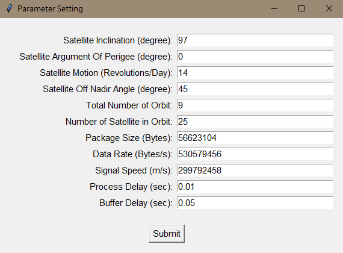
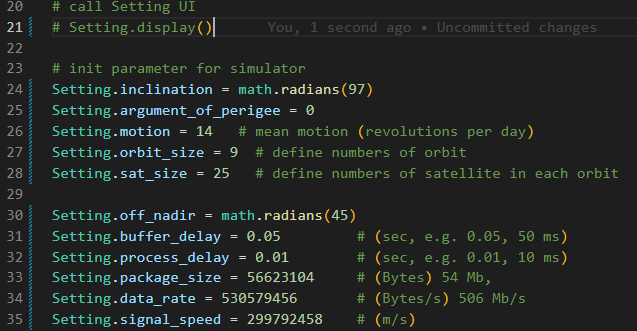

# satellite_delay_analysis

## Introduction

The overall objective is to analyze if the data download deadline can be met given the data on an LEO satellite can be transferred either directly to a ground station or via some other LEO satellite, given a configuration of an LEO satellite constellation and a set of ground stations. The analysis is conducted based on the simulation of the communication behavior between LEO satellites and between an LEO satellite and the ground stations.

---

## Guideline

### Setting

To Set up the parameter of the Simulator. A settings folder contains the setting file as below.

| Setting file name       | description                                                                      | format                                               |
| ----------------------- | -------------------------------------------------------------------------------- | ---------------------------------------------------- |
| main_GROUND_STATION.txt | use for simulator, contain only one ground station as the point data transfer to | Latitude(degree) Longitude(degree) elevation(degree) |
| main_OBSERVATION.text   | use for simulator, contain only one observation point as the poin to observe    | Latitude(degree) Longitude(degree)                   |
| test_GROUND_STATION.txt | use for testing. contain a ground station list                                   | Latitude(degree) Longitude(degree) elevation(degree) |
| test_OBSERVATION.txt    | use for testing, contain a observation points list as the poin to observe        | Latitude(degree) Longitude(degree)                   |
| TIME_INTERVAL.txt       | use for simulator and testing, define the datetime of simulator                 | yyyy MM dd hh mm ss                                  |

### Execute

At the project directory, run the main.py file to start the Simulator, comment as below.

```
python main.py
```

After starting the Simulator, a window with default value is created to set up the parameter.


if want to disable the Setting Window, please open the main.py and follow the step below.

1. go to line 21, comment or delete the code, as below

    ```
    Setting.display()
    ```


2. uncomment the code from line 24 to 35 as below.


3. If want to modify the value, just change the value in line 24 to 35.

### Result